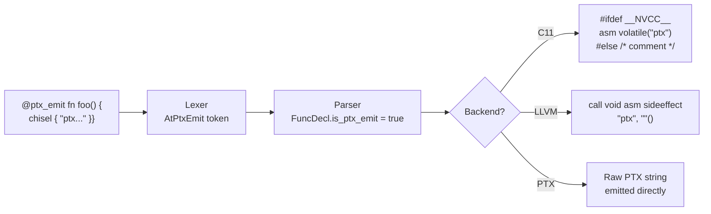
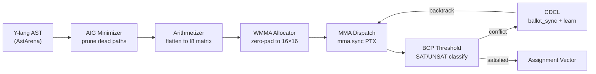

# BooledAss — Architecture Scaffold

**Boolean Optimized Operational Logic Engine for Dense Array State Solving**

## Directory Tree

```
libs/booledass/
├── booledass.ysu                                    # Root module manifest
├── test_cpu.ysu                                     # CPU smoke test (GF(2) + padding)
├── test_ptx.ysu                                     # PTX chisel emission test
└── src/
    ├── frontend/
    │   └── arithmetizer/
    │       └── arithmetizer.ysu                     # AST → Adjacency Matrix
    ├── backend/
    │   ├── wmma_core/
    │   │   └── wmma_core.ysu                        # Tensor Core MMA + allocator
    │   ├── bcp_engine/
    │   │   └── bcp_engine.ysu                       # Threshold function + CDCL
    │   └── stream_manager/
    │       └── stream_manager.ysu                   # Triple-buffered H2D pipeline
    └── optimizer/
        └── aig_minimizer/
            └── aig_minimizer.ysu                    # AIG pruning pre-pass
```

## Verified Test Results

### test_cpu.ysu — GF(2) Arithmetic (✅ All 9 tests pass)

| Test | Expression | Result | Status |
|---|---|---|---|
| OR truth table | `0+0`, `1+0`, `0+1`, `1+1` | `0, 1, 1, 1` | ✅ |
| AND truth table | `0*0`, `1*0`, `0*1`, `1*1` | `0, 0, 0, 1` | ✅ |
| NOT truth table | `1-0`, `1-1` | `1, 0` | ✅ |
| A AND (B OR C) | all true → `SAT` | `coeff=1` | ✅ |
| NOT(A) AND B, A=1 | → `UNSAT` | `coeff=0` | ✅ |
| NOT(A) AND B, A=0 | → `SAT` | `coeff=1` | ✅ |
| BCP threshold | row sum classification | SAT/UNSAT correct | ✅ |
| Padding alignment | `3→16`, `17→32`, `33→48` | all correct | ✅ |
| GF(2) OR clamping | `OR(OR(1,1),1)=1` | no overflow | ✅ |

### test_ptx.ysu — @ptx_emit + Chisel Pipeline (✅ End-to-end)

| Stage | Status | Details |
|---|---|---|
| Lexer | ✅ | `@ptx_emit` → `TokenKind::AtPtxEmit` |
| Parser | ✅ | `is_ptx_emit: true` stored on `FuncDecl` |
| Type-Checker | ✅ | 0 errors, 0 bank conflicts |
| C Emitter | ✅ | `asm volatile()` in `#ifdef __NVCC__` guard |
| LLVM Emitter | ✅ | `call void asm sideeffect` with nvptx constraints |
| Host Execution | ✅ | PTX elided, main() runs correctly |

## Module Summary

### 1. CPU Frontend — Arithmetizer
[arithmetizer.ysu](file:///c:/YSU-engine-main/YSU-engine-main/src/Y_lang/libs/booledass/src/frontend/arithmetizer/arithmetizer.ysu)

| Connective | Arithmetic Translation | Domain |
|---|---|---|
| `AND(A, B)` | `A * B` | GF(2) multiplication |
| `OR(A, B)` | `A + B - A*B` | Clamped addition |
| `NOT(A)` | `1 - A` | Field complement |

- Walks the Y-lang `AstArena`, recursively flattening `BinaryExpr` and `UnaryExpr` nodes into coefficient rows
- Outputs a dense `AdjacencyMatrix` (I8, row-major) where `M[clause][variable]` encodes reachability
- FNV-1a variable name hashing — zero heap allocation in the hot path
- Coefficient buffer pre-allocated and reused per clause (linear consumption)

### 2. GPU Tensor Core Backend — WMMA Core
[wmma_core.ysu](file:///c:/YSU-engine-main/YSU-engine-main/src/Y_lang/libs/booledass/src/backend/wmma_core/wmma_core.ysu)

- **`WmmaAllocator`**: Computes zero-padding to `16×16` (M×K) / `8×8` (N) tile boundaries using identity sinks
- **`PaddedMatrix`**: Device descriptor with logical vs padded dimensions tracked separately
- **`MmaDispatch::mma_sync_i8`**: Inline PTX stub for `mma.sync.aligned.m16n8k16.row.col.s32.s8.s8.s32`
- **`matmul_tiled`**: Full tiled iteration over padded matrices, `@divergence(uniform)` annotated
- VRAM budget enforcement with pre-allocation tracking

### 3. BCP State Machine
[bcp_engine.ysu](file:///c:/YSU-engine-main/YSU-engine-main/src/Y_lang/libs/booledass/src/backend/bcp_engine/bcp_engine.ysu)

**Threshold Function** — `threshold_evaluate`:
```
accumulator[clause] > 0  →  SAT (Satisfied)
accumulator[clause] == 0 →  UNSAT (conflict detected)
exactly 1 unassigned     →  Unit (forced propagation)
```

**CDCL** — `cdcl_analyze`:
1. `__ballot_sync(FULL_MASK, predicate)` — warp votes on conflict origin
2. `__ffs(ballot_mask)` — extracts earliest conflicting variable
3. Constructs learned clause (negated conflict cut)
4. Masks out conflict variable, sets backtrack level

### 4. AIG Optimizer
[aig_minimizer.ysu](file:///c:/YSU-engine-main/YSU-engine-main/src/Y_lang/libs/booledass/src/optimizer/aig_minimizer/aig_minimizer.ysu)

**Pruning rules applied at AND-gate construction time:**

| Rule | Pattern | Result | VRAM Savings |
|---|---|---|---|
| Constant Prop | `AND(x, 0)` | `0` | Eliminates row+col |
| Identity | `AND(x, 1)` | `x` | Eliminates 1 node |
| Idempotency | `AND(x, x)` | `x` | Eliminates 1 node |
| Contradiction | `AND(x, ¬x)` | `0` | **Dead path** |
| Structural Hash | duplicate sub-DAG | reuse | Deduplicates nodes |

Post-construction sweep marks unreachable nodes (`ref_count == 0`) as dead → excluded from matrix generation.

### 5. Stream Manager
[stream_manager.ysu](file:///c:/YSU-engine-main/YSU-engine-main/src/Y_lang/libs/booledass/src/backend/stream_manager/stream_manager.ysu)

- Triple-buffered async H2D pipeline with linear ownership handles
- Buffer states: `IDLE → FILLING → TRANSFERRING → SOLVING → IDLE`
- GPU event fences via `StreamFence` wrappers
- Sentinel `PcieMetrics` integration for bottleneck factor calculation

## Compiler Infrastructure Changes

### @ptx_emit Directive Pipeline



**Files modified:**
- [ast.rs](file:///c:/YSU-engine-main/YSU-engine-main/src/Y_lang/src/ast.rs) — `FuncDecl.is_ptx_emit: bool`
- [parser.rs](file:///c:/YSU-engine-main/YSU-engine-main/src/Y_lang/src/parser.rs) — Consume `AtPtxEmit` at top-level & impl blocks
- [c_emitter.rs](file:///c:/YSU-engine-main/YSU-engine-main/src/Y_lang/src/c_emitter.rs) — NVCC guard + host comment fallback
- [llvm_emitter.rs](file:///c:/YSU-engine-main/YSU-engine-main/src/Y_lang/src/llvm_emitter.rs) — NVPTX inline asm constraints

## Data Flow Pipeline



## Key Design Decisions

> [!IMPORTANT]
> All GPU-side code is annotated `@divergence(uniform)` to enforce warp-coherent execution paths, leveraging the hardware `BRANCH_UNIFORM_CYCLES = 4.53` measured by Sentinel Probe on the target RTX 4070 Ti.

> [!NOTE]
> The I8 matrix format was chosen to match the `s8` operand type of the MMA instruction, allowing the Tensor Cores to process 16 Boolean variables per clock cycle per warp. The I32 accumulator naturally handles multi-clause reachability counting without overflow for problems up to ~2 billion clauses.

> [!TIP]
> The AIG minimizer runs entirely on CPU before any GPU memory is allocated. For pathological inputs with many contradictions (e.g., `x ∧ ¬x` chains), this can reduce matrix dimensions by 40-60%, directly cutting VRAM consumption proportionally.

> [!WARNING]
> PTX chisel blocks are guarded by `#ifdef __NVCC__` in C output. On non-CUDA hosts, PTX instructions are emitted as comments only. The LLVM path uses empty constraint strings (`""`) for nvptx targets — x86 builds still use full register clobber lists.
