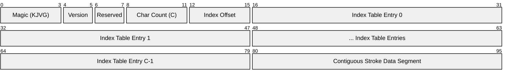

# KanjiVG Compact Binary Layout (.kjvg) Specification

This document details the architectural layout of the `.kjvg` (Kanji Vector Graphics) binary format. It is optimized for zero-copy memory mapping (`mmap`), instantaneous lookups via binary search ($O(\log C)$ where $C$ is the number of characters), and maximum hardware cache locality.

## 1. Architectural Goals
- **Zero Heap Allocations**: The engine reads directly from the memory-mapped pointer without unpacking or deserializing data.
- **Cache-Line Alignment**: Structure boundaries are aligned to 64-byte or 16-byte boundaries where possible to optimize hardware cache-line fills.
- **Hardware-Friendly Types**: All coordinates are pre-scaled and packed into 16-bit unsigned integers (`U16`) to fit within compact SIMD registers (e.g., AVX-512) and reduce RAM bandwidth.

---

## 2. File Format Layout

### 2.1 File Header (16 Bytes)
| Byte Offset | Type     | Field Name     | Description |
|-------------|----------|----------------|-------------|
| 0–3         | `char[4]`| `magic`        | Magic identifier: `"KJVG"` |
| 4–5         | `U16`    | `version`      | Version number (currently `1`) |
| 6–7         | `U16`    | `reserved`     | Padding for 32-bit alignment (set to `0`) |
| 8–11        | `U32`    | `char_count`   | Total number of Kanji characters in the file |
| 12–15       | `U32`    | `index_offset` | Offset to the index table (usually `16`) |

### 2.2 Index Table (Fixed-Size entries, sorted by `codepoint`)
The index table starts immediately at `index_offset`. Every entry is exactly **16 bytes** wide, which guarantees that lookups can be computed via simple array offset math: `EntryAddress = BaseAddress + index_offset + (index * 16)`.
The table is sorted ascending by `codepoint` to enable $O(\log C)$ binary search.

| Field Byte Offset | Type   | Field Name     | Description |
|-------------------|--------|----------------|-------------|
| 0–3               | `U32`  | `codepoint`    | UTF-32/UCS-4 Unicode codepoint of the Kanji |
| 4–5               | `U16`  | `stroke_count` | Number of strokes making up this character |
| 6–7               | `U16`  | `reserved`     | Set to `0` for 64-bit data_offset alignment |
| 8–15              | `U64`  | `data_offset`  | Absolute byte offset from file start to Stroke Data block |

### 2.3 Character Stroke Data Block
At the byte offset specified by `data_offset`, a contiguous block of memory contains the vectors for the character.
For each stroke $i \in [0, \text{stroke\_count}-1]$:

| Field Byte Offset | Type       | Field Name    | Description |
|-------------------|------------|---------------|-------------|
| 0–1               | `U16`      | `point_count` | Number of points in this stroke |
| 2–3               | `U16`      | `reserved`    | Padding for 32-bit alignment of coordinates |
| 4–X               | `Point2D[]`| `points`      | Contiguous array of `point_count` 2D coordinate structs |

#### Point2D Coordinate Struct (4 Bytes)
| Byte Offset | Type  | Field Name | Description |
|-------------|-------|------------|-------------|
| 0–1         | `U16` | `x`        | X-coordinate scaled to `[0, 65535]` representing `[0.0, 512.0]` |
| 2–3         | `U16` | `y`        | Y-coordinate scaled to `[0, 65535]` representing `[0.0, 512.0]` |

---

## 3. Fast Pointer-Arithmetic Lookup Logic

Because the file contains no pointers (only relative offsets), it is fully **relocatable**. It can be mapped into memory via `mmap()` or loaded into a single contiguous buffer.

### Lookup Workflow
1. Read `char_count` from byte `8` of the mapped file pointer `file_ptr`.
2. Binary search the index table spanning from `file_ptr + index_offset` to `file_ptr + index_offset + (char_count * 16)` for the target Unicode codepoint.
3. Once the matching entry is found, extract `stroke_count` and `data_offset`.
4. The pointer to the character's stroke data block is:
   `char_data_ptr = file_ptr + data_offset`
5. Walk the stroke data blocks sequentially. Since each stroke is variable size based on its `point_count`, the offset to the next stroke block is calculated by:
   `next_stroke_ptr = current_stroke_ptr + 4 + (current_stroke_ptr->point_count * 4)`

This pointer traversal is extremely cache-friendly since all strokes for a single Kanji are stored in one contiguous block.
