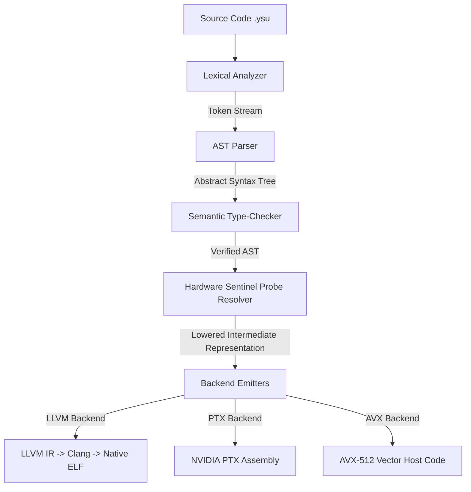

# Y Language: The Definitive Specification & Programmer's Reference Manual
Version 1.0 (Operational Systems Programming Language)

Y is a hardware-sentient, low-level systems programming language designed for high-performance computing, lock-free concurrency, and hardware-aware GPGPU/CPU acceleration. It couples structural type checking with hardware profiles (gathered via Sentinel Probes) to enforce optimal performance traits, cache alignments, memory layouts, and register usage directly at compile time.

---

## 1. Introduction & Design Philosophy

Traditional programming languages abstract away the underlying microarchitecture, resulting in suboptimal memory access patterns, cache thrashing, branch divergence, and thread serialization. Y flips this paradigm: **the compiler is co-designed with the hardware profile**.

### Core Pillars of Y:
1. **Hardware Sentience**: The compiler queries a local hardware profile (`.ysu_hw_profile`) generated by a Sentinel hardware probe. This profile reports features like L2 cache line size, SIMD vector lane sizes, thread scheduling costs, warp sizes, memory latency, and GPU execution latencies (Tensor Core, FMA, Shared Memory, etc.).
2. **Linear Memory Obligations**: The type-checker tracks the lifetime of asynchronous transactions (such as global-to-shared transfers) to prevent data races and ensure synchronization boundaries are met before values are consumed.
3. **Zero Bank Conflicts**: The compiler statically analyzes shared memory layouts and warp-level access index strides to predict and prevent bank conflicts.
4. **Explicit Hardware Mapping**: Variable allocations, layout qualifiers, and concurrency operations map directly to hardware mechanisms (such as C11 standard atomics/alignments, and LLVM IR volatile accesses, non-temporal cache bypasses, and inline assembly).

---

## 2. Compiler Pipeline Architecture

The Y compiler is designed as a multi-stage, high-throughput toolchain. Below is a detailed view of its execution flow:



### Compiler Phases:
1. **Lexical Analysis (`lexer.rs`)**: Tokenizes the raw source input into a flat token stream. Identifies keywords, datatypes, operators, and metadata decorators.
2. **Syntax Parsing (`parser.rs`)**: Consumes tokens and constructs an Abstract Syntax Tree (AST). Resolves module dependencies (`import`) recursively.
3. **Semantic Type Checking (`type_checker.rs`)**: Validates type safety, verifies structural alignments, ensures bank-conflict-free access patterns, and tracks linear memory obligations.
4. **Hardware Sentinel Resolver (`sentinel.rs`)**: Matches hardware constraints specified by `@require` decorators against physical microarchitectural capabilities.
5. **Backend Emission**: Translates verified code to native backends:
   * `llvm_emitter.rs`: Outputs target-specific LLVM IR with cache hints and atomic constraints.
   * `ptx_emitter.rs`: Emits highly optimized GPU PTX assembly.
   * `cpu_emitter.rs`: Generates target-specific AVX-512 vector code.

---

## 3. Formal EBNF Grammar Specification

Below is the formal Extended Backus-Naur Form (EBNF) grammar representing the syntax of the Y programming language:

```ebnf
Program         = { Item } ;
Item            = ImportDecl | StructDecl | EnumDecl | ImplBlock | FuncDecl | KernelDecl ;

ImportDecl      = "import" , Ident , { "::" , Ident } , ";" ;
StructDecl      = { Attr } , "struct" , Ident , [ Generics ] , "{" , { FieldDecl } , "}" ;
FieldDecl       = { Attr } , Ident , ":" , Type , "," ;

EnumDecl        = { Attr } , "enum" , Ident , "{" , { EnumVariant } , "}" ;
EnumVariant     = Ident , [ "(" , Type , ")" ] , "," ;

ImplBlock       = "impl" , [ Generics ] , Ident , [ Generics ] , "{" , { FuncDecl } , "}" ;

FuncDecl        = { Attr } , "fn" , Ident , [ Generics ] , ParameterList , [ "->" , Type ] , Block ;
KernelDecl      = { Attr } , "kernel" , Ident , ParameterList , Block ;

Generics        = "<" , Ident , { "," , Ident } , ">" ;
ParameterList   = "(" , [ Parameter , { "," , Parameter } ] , ")" ;
Parameter       = [ "mut" ] , Ident , ":" , Type ;

Type            = PrimitiveType | ArrayType | PointerType | ReferenceType | UserType ;
PrimitiveType   = "F16" | "BF16" | "TF32" | "F32" | "F64" | "I8" | "I16" | "I32" | "I64" | "U8" | "U16" | "U32" | "U64" | "bool" | "String" ;
ArrayType       = "[" , Type , ";" , Expr , "]" ;
PointerType     = "ptr" ;
ReferenceType   = "&" , [ "mut" ] , Type ;
UserType        = Ident , [ Generics ] ;

Block           = "{" , { Stmt } , "}" ;
Stmt            = LetStmt | AssignStmt | IfStmt | ForStmt | WhileStmt | ReturnStmt | ChiselStmt | ExprStmt ;

LetStmt         = { Attr } , "let" , Ident , [ ":" , Type ] , "=" , Expr , ";" ;
AssignStmt      = Expr , "=" , Expr , ";" ;
IfStmt          = "if" , Expr , Block , [ "else" , Block ] ;
ForStmt         = "for" , Ident , "in" , Expr , ".." , Expr , [ "step" , Expr ] , Block ;
WhileStmt       = "while" , Expr , Block ;
ReturnStmt      = "return" , [ Expr ] , ";" ;
ChiselStmt      = "chisel" , "{" , { StringLiteral } , "}" ;
ExprStmt        = Expr , ";" ;

Expr            = BinaryExpr | UnaryExpr | PrimaryExpr ;
BinaryExpr      = Expr , BinaryOp , Expr ;
UnaryExpr       = UnaryOp , Expr ;
PrimaryExpr     = Ident | Literal | CallExpr | IndexExpr | MemberExpr | StructInit | ZeroInit | ParenExpr ;

CallExpr        = Expr , "(" , [ Expr , { "," , Expr } ] , ")" ;
IndexExpr       = Expr , "[" , Expr , "]" ;
MemberExpr      = Expr , "." , Ident ;
StructInit      = Ident , "{" , [ FieldInit , { "," , FieldInit } ] , "}" ;
FieldInit       = Ident , ":" , Expr ;
ZeroInit        = "{" , "}" ;
ParenExpr       = "(" , Expr , ")" ;

Attr            = "@" , Ident , [ "(" , [ Expr , { "," , Expr } ] , ")" ] ;
```

---

## 4. Generics and Monomorphization

Y supports parametric polymorphism (generics) for structs, implementations, and functions. Because execution depends on hardware layout boundaries, Y uses **static monomorphization**:

1. **AST Duplication**: When a generic type is instantiated (e.g. `RingBuffer<I32, 1024>`), the compiler duplicates the AST representation of the struct and its implementations.
2. **Generic Parameter Substitution**: Placeholders `T` and `SIZE` are replaced with concrete types and compile-time evaluated integer values.
3. **Type-Checking Specialized Code**: The monomorphized code undergoes semantic checks (including alignment constraints and hardware checks) unique to the specialized parameters. For example, a larger `SIZE` might trigger cache line warnings or GPU shared memory block layout shifts.

---

## 5. Type System & Memory Spaces

Y divides data types into two main categories: primitive scalar types and hardware-aware layout types.

### 5.1 Scalar and Compound Types
* **Floating-Point**: `F16` (half precision), `BF16` (bfloat16), `TF32` (TensorFloat-32), `F32` (single float), `F64` (double float).
* **Integers**: `I8` through `I64` (signed), `U8` through `U64` (unsigned), and `u3` (3-bit register values for GEP indexing).
* **Fixed-Point**: `QFixed` types represent values using fixed fractional scaling. For example, `Q32.32` reserves 32 bits for the integer part and 32 bits for the fraction.
* **References**: `&T` represents an immutable reference; `&mut T` represents a mutable reference.
* **Arrays**: Array declarations use syntax like `[T; Size]` (e.g. `[I32; 1024]`).

### 5.2 Hardware Memory Spaces
To optimize data transfers, variables and buffers must reside in designated hardware memory spaces:

#### 1. GlobalMemory`<T>`
Global VRAM or System RAM. Large-capacity, high-latency. Must be accessed via cache policies or explicit streaming.
```ysu
let vram_ptr: GlobalMemory<F32> = ...;
```

#### 2. L2Memory`<T>`
Bypasses level 1 caches to interface directly with L2 caches. Useful for data shared across multiple thread blocks.
```ysu
let cache_ptr: L2Memory<I32> = ...;
```

#### 3. SharedMemory
GPU-resident Local SRAM. Shared across threads in a warp or block. Subject to bank conflicts.
```ysu
let smem_buffer = SharedMemory::alloc<SmemLayout<F32, rows=8, cols=32, swizzle=0>>();
```

#### 4. RegisterFile
Variables declared inside local function blocks map to registers. This is the fastest, lowest-latency storage area.
```ysu
let local_accumulator: F32 = 0.0;
```

---

## 6. Compile-Time Verification & Analysis

### 6.1 Structural Type Checking
Y utilizes structural type equivalence for layouts and complex variables. Types match if their memory footprint, byte offset boundaries, and layout alignments are identical, ensuring safe reinterpret casts.

### 6.2 Linear Memory Obligations
Linear tracking enforces that resources (like asynchronous memory transfers) cannot be left in indeterminate states:

```
[Start cp_async] ---> State: InFlight (Transfer Obligation created)
                            |
                     [Attempt read] ---> Compile Error: Data race hazard!
                            |
                     [Pipeline::wait] -> State: Completed
                            |
                     [Attempt read] ---> State: Safe (Obligation resolved)
```

Every `Transfer` token returned by `cp_async` must be statically consumed by a corresponding `Pipeline::wait()` instruction before any read operations from that buffer are permitted.

### 6.3 Shared Memory Bank Conflict Solver
GPU shared memory consists of 32 parallel banks. The compiler maps variable read strides to bank indices:

$$\text{Bank} = \left(\frac{\text{Byte Offset}}{4}\right) \pmod{32}$$

If two threads within a 32-thread warp access indices with the same $\text{Bank}$ index in the same cycle, the compiler generates a bank conflict warning and advises layout swizzling (e.g., using `swizzle=330`).

---

## 7. Emitter Lowering & Code Generation

The following table details how high-level Y structures map directly to target LLVM IR code during lowering:

| Y Syntax / Decorator | LLVM IR Representation |
|---|---|
| `@atomic` (Field Load) | `%val = load atomic i32, ptr %ptr seq_cst, align 4` |
| `@atomic` (Field Store) | `store atomic i32 %val, ptr %ptr seq_cst, align 4` |
| `@align(N)` | `load i32, ptr %ptr, align N` or `store i32 %val, ptr %ptr, align N` |
| `@gpu_uncached` | `%val = load volatile ptr, ptr %ptr, !nontemporal !0` |
| Zero Initialization `{}` | `call void @llvm.memset.p0.i64(ptr %var, i8 0, i64 %size, i1 false)` |
| Array Indexing `arr[idx]` | `%ptr = getelementptr i32, ptr %arr, i32 %idx` |
| `@inline` | `attributes #0 = { alwaysinline }` |
| `@noinline` | `attributes #0 = { noinline }` |

---

## 8. Standard Library Reference

Y provides a built-in runtime library for environment interaction, system allocations, file access, and vector manipulation:

### 8.1 File I/O
* **`yfile_read_to_string(path: ptr) -> ptr`**: Reads file contents to a string pointer.
* **`yfile_write(path: ptr, content: ptr)`**: Writes string content to disk.

### 8.2 String Manipulation
* **`ystr_new(cstr: ptr) -> ptr`**: Creates a new Y-string from a C-string literal.
* **`ystr_push(s: ptr, ch: i8)`**: Appends a character.
* **`ystr_push_str(s: ptr, append: ptr)`**: Appends a string.
* **`ystr_eq_cstr(s: ptr, cstr: ptr) -> bool`**: Compares string contents.
* **`ystr_len(s: ptr) -> i64`**: Returns string byte count.
* **`ystr_char_at(s: ptr, idx: i64) -> i8`**: Returns character index.
* **`ystr_clone(s: ptr) -> ptr`**: Clones string allocation.

### 8.3 Vector Types
* **`yvec_new(capacity: i64) -> ptr`**: Allocates a new vector.
* **`yvec_push(vec: ptr, item: ptr)`**: Appends an item.
* **`yvec_get(vec: ptr, idx: i64) -> ptr`**: Retrieves element pointer.
* **`yvec_len(vec: ptr) -> i64`**: Returns vector element count.

### 8.4 General Utilities
* **`printf(fmt: ptr, ...)`**: Direct format printer.
* **`malloc(size: i64) -> ptr`**: Dynamic memory allocation.
* **`free(ptr: ptr)`**: Dynamic memory reclamation.
* **`exit(code: i32)`**: Aborts execution.
* **`println(s: ptr)`**: Prints a string to stdout with a trailing newline.
* **`print_int(val: i64)`**: Prints an integer.

---

## 9. Exhaustive Reference: Language Attributes (Decorators)

Decorators instruct the parser, type-checker, and backend emitters on how to handle specific variables, functions, and memory structures.

### 9.1 `@require`
* **Syntax**: `@require(hardware_feature_condition)`
* **Usage**: Placed above `kernel` or `fn` definitions.
* **Function**: Checks the user's `.ysu_hw_profile` at compile time. If the system does not support the requested features, compilation terminates.
* **Example**:
```ysu
@require(avx512 >= 1)
fn vector_add_avx512(A: &mut [F32; 16], B: &[F32; 16]) {
    // LLVM backend lowers this to AVX-512 register instructions
}
```

### 9.2 `@cache_policy`
* **Syntax**: `@cache_policy(PolicyType, [options])`
* **Usage**: Decorator for let-bindings that load from memory.
* **Function**: Tells the compiler which memory load instructions to emit to optimize cache usage.
* **Policies**:
  * `L2_PERSIST`: Flags memory pages to remain resident in L2 cache.
  * `L2_EVICT_FIRST`: Evicts the loaded cache line as soon as possible to free up cache space.
  * `L2_EVICT_LAST`: Prevents early eviction of this data.
  * `L2_STREAM`: Streams data directly to registers, bypassing the cache entirely.
* **Example**:
```ysu
// Keep weights in L2 Cache for reuse
@cache_policy(L2_PERSIST, reuse_count=16)
let weight_val: F32 = load(global_weights);
```

### 9.3 `@atomic`
* **Syntax**: `@atomic`
* **Usage**: Attribute on struct field declarations or variable bindings.
* **Function**:
  * **C Backend**: Translates to `_Atomic`.
  * **LLVM Backend**: Translates to atomic instructions (`load atomic ... seq_cst`, `store atomic ... seq_cst`).
* **Example**:
```ysu
struct Lock {
    @atomic state: I32,
}

fn lock_acquire(l: &mut Lock) {
    while l.state == 1 {
        // Spin lock
    }
    l.state = 1; // Atomic write
}
```

### 9.4 `@align`
* **Syntax**: `@align(ByteBoundary)`
* **Usage**: Applied to struct fields or variables.
* **Function**: Prevents cache-line false sharing in multi-threaded environments.
  * **C Backend**: Lowers to C11 `_Alignas(ByteBoundary)`.
  * **LLVM Backend**: Generates `, align ByteBoundary` qualifiers on loads and stores.
* **Example**:
```ysu
struct ThreadState {
    @align(64) @atomic head: I32, // Cache line size alignment (64 bytes)
    @align(64) @atomic tail: I32, // Resides in a separate cache line to prevent false-sharing
}
```

### 9.5 `@gpu_uncached`
* **Syntax**: `@gpu_uncached`
* **Usage**: Applied to memory buffers or struct fields.
* **Function**: Bypasses GPU caches entirely. Useful for ring buffers, shared state, and GPU-to-CPU status flags.
  * **C Backend**: Lowers to `volatile` qualifier.
  * **LLVM Backend**: Emits `volatile` loads/stores along with `!nontemporal !0` metadata to instruct clang to bypass the cache hierarchy.
* **Example**:
```ysu
struct IPCChannel {
    @gpu_uncached status: I32, // Bypasses cache to guarantee immediate visibility
}
```

### 9.6 `@ZeroDrift`
* **Syntax**: `@ZeroDrift`
* **Usage**: Let-bindings for float accumulations.
* **Function**: Inserts software compensation blocks (Kahan summation algorithm) to eliminate precision loss caused by floating-point rounding errors.
* **Example**:
```ysu
@ZeroDrift
let sum: F32 = 0.0;
for i in 0..1000000 {
    sum += data[i]; // Compensated mathematically at runtime
}
```

### 9.7 `@ptx_emit`, `@avx_emit`, and `@hdl_emit`
* **Syntax**: `@ptx_emit`, `@avx_emit`, `@hdl_emit`
* **Usage**: Annotations on functions or kernels.
* **Function**: Forces the compiler to lower the decorated function to a specific backend assembly format (NVIDIA PTX, CPU AVX, or Verilog/HDL).
* **Example**:
```ysu
@ptx_emit
fn gpu_special_op(a: F32) -> F32 {
    // Lowers directly to PTX instructions
}
```

### 9.8 `@inline` and `@noinline`
* **Syntax**: `@inline`, `@noinline`
* **Usage**: Function annotations.
* **Function**: Controls inlining optimizations.
* **Example**:
```ysu
@noinline
fn complex_slow_path() {
    // Prevents code size inflation
}
```

### 9.9 `@safe` and `@unsafe`
* **Syntax**: `@safe`, `@unsafe`
* **Usage**: Blocks or function annotations.
* **Function**: Toggles compile-time memory safety checks (e.g. pointer arithmetic and out-of-bounds array indexing).
* **Example**:
```ysu
@unsafe {
    let raw_addr: ptr = malloc(1024);
    // Arbitrary pointer arithmetic allowed
}
```

### 9.10 `@bounds`
* **Syntax**: `@bounds(condition)`
* **Usage**: Variable declarations or loops.
* **Function**: Asserts index limits to skip runtime bounds checks.
* **Example**:
```ysu
@bounds(0 <= index < 256)
let element: I32 = my_array[index]; // Skips safety bounds checks
```

### 9.11 `@invariant`
* **Syntax**: `@invariant(condition)`
* **Usage**: Iteration/loop loops scopes.
* **Function**: Declares a condition that is statically proven to hold true before and after each loop iteration.
* **Example**:
```ysu
for i in 0..100 {
    @invariant(accumulator >= 0)
    accumulator = accumulator + data[i];
}
```

### 9.12 `@tile`
* **Syntax**: `@tile(dimension_size, stride_step)`
* **Usage**: Nested loops or parallel iterations.
* **Function**: Optimizes layout caches by breaking 2D/3D operations into smaller block execution units.
* **Example**:
```ysu
for i in 0..1024 {
    @tile(16, 4)
    do_compute(i);
}
```

### 9.13 `@ghost`
* **Syntax**: `@ghost`
* **Usage**: Variable declarations or code scopes.
* **Function**: Declares variables that only exist for static compile-time constraint validation and assertions. These are completely stripped out by codegen and cost zero execution cycles.
* **Example**:
```ysu
@ghost let verification_step: I32 = 0;
for i in 0..10 {
    @ghost {
        verification_step = verification_step + 1;
    }
}
```

### 9.14 `@prefetch_stride`
* **Syntax**: `@prefetch_stride(byte_width)`
* **Usage**: Loop structures.
* **Function**: Inserts cache lines prefetch instructions (`_mm_prefetch` in AVX, `prefetch` in PTX) targeting memory boundaries offset by the stride width.
* **Example**:
```ysu
for i in 0..512 {
    @prefetch_stride(64) // Prefetch next cache line (64 bytes ahead)
    process(data[i]);
}
```

### 9.15 `@clock_domain`
* **Syntax**: `@clock_domain(name_string)`
* **Usage**: Fields, variables, or function blocks compiled with `@hdl_emit`.
* **Function**: Assigns signal registers to specific hardware clock domains, forcing the synthesis engine to insert synchronizers at crosses.
* **Example**:
```ysu
@clock_domain("clk_125mhz")
struct Receiver {
    data: I32,
    ready: bool,
}
```

### 9.16 `@divergence`
* **Syntax**: `@divergence(uniform | branchy)`
* **Usage**: Loop structures or branch decisions.
* **Function**: Instructs GPGPU emitters on whether warp threads will trace parallel divergent paths, allowing register file and barrier optimizations.
* **Example**:
```ysu
@divergence(uniform)
if global_thread_id < warp_limit {
    execute_warp_op();
}
```

---

## 10. Complete Code Examples

### Example 1: Lock-Free Single-Producer Single-Consumer (SPSC) Ring Buffer
```ysu
// Lock-Free Single-Producer Single-Consumer Ring Buffer
struct RingBuffer {
    @align(64) @atomic head: I32,
    @align(64) @atomic tail: I32,
    @gpu_uncached buffer: [I32; 1024],
}

fn try_enqueue(rb: &mut RingBuffer, item: I32) -> bool {
    let h: I32 = rb.head;
    let t: I32 = rb.tail;
    
    // Check if buffer is full
    let next_head: I32 = (h + 1) % 1024;
    if next_head == t {
        return false;
    }

    // Write item directly to uncached memory
    rb.buffer[h] = item;

    // Atomic release store update
    rb.head = next_head;
    return true;
}

fn try_dequeue(rb: &mut RingBuffer, out_item: &mut I32) -> bool {
    let h: I32 = rb.head;
    let t: I32 = rb.tail;

    // Check if buffer is empty
    if h == t {
        return false;
    }

    // Read item directly from uncached memory
    *out_item = rb.buffer[t];

    // Atomic release store update
    rb.tail = (t + 1) % 1024;
    return true;
}

fn main() -> I32 {
    let rb: RingBuffer = {};
    let success: bool = try_enqueue(&mut rb, 1337);
    
    let val: I32 = 0;
    let dequeued: bool = try_dequeue(&mut rb, &mut val);
    
    return val;
}
```

---

### Example 2: Matrix Multiplication (GEMM) Kernel
```ysu
@require(avx512 >= 1)
kernel matmul(A: GlobalMemory<F16>, B: GlobalMemory<F16>, C: GlobalMemory<F32>) {
    // 16x64 Swizzled Shared Memory Layout
    type ATile = SmemLayout<F16, rows=16, cols=64, swizzle=330>;
    let smem_A = SharedMemory::alloc<ATile>();

    // Load inputs with persisting L2 cache policy
    @cache_policy(L2_PERSIST, reuse_count=8)
    let weights: F16 = load(A);

    // Load dynamic inputs with evict first policy
    @cache_policy(L2_EVICT_FIRST)
    let act: F16 = load(B);
    
    // Fragment registers for Tensor Core MMA
    let acc: Fragment<MMA_m16n8k16, D, F32> = Fragment::zero();
    let pipe: Pipeline<stages=2, layout=ATile> = Pipeline::init();

    for k in 0..1024 step 16 {
        // Asynchronous transfer from global memory to swizzled shared memory
        let tx_A: Transfer<Global, Shared, Async<1>, 128> = cp_async(A[k], smem_A);
        
        // Wait for pipeline stages
        pipe.wait(tx_A);
        
        // Synchronize warp thread accesses
        barrier::sync();
        
        // Load data from shared memory into register fragments
        let frag_A: Fragment<MMA_m16n8k16, A, F16> = ldmatrix(smem_A);
        let frag_B: Fragment<MMA_m16n8k16, B, F16> = ldmatrix(smem_A);
        let frag_C: Fragment<MMA_m16n8k16, C, F32> = ldmatrix(smem_A);
        
        // Low level assembly injection
        chisel {
            "ldmatrix.sync.aligned.m8n8.x4.shared.b16 {r0,r1,r2,r3}, [smem_ptr];";
        }

        // Perform Warp-Level Matrix Multiply Accumulate (MMA)
        acc = mma_sync(frag_A, frag_B, frag_C); 
    }

    // Write final output register fragments back to global memory
    store(acc, C);
}
```

---

### Example 3: Stream Vector Addition with L2 Bypass
```ysu
kernel stream_vector_add(A: GlobalMemory<F32>, B: GlobalMemory<F32>, C: GlobalMemory<F32>, N: I32) {
    for i in 0..N {
        // Stream data to bypass L1/L2 caches
        @cache_policy(L2_STREAM)
        let a_val: F32 = A[i];

        @cache_policy(L2_STREAM)
        let b_val: F32 = B[i];

        @cache_policy(L2_STREAM)
        C[i] = a_val + b_val;
    }
}
```

---

### Example 4: Fixed-Point Signal Filtering Algorithm
```ysu
struct FilterState {
    coefficient: Q32.32,
    prev_value: Q32.32,
}

fn apply_filter(state: &mut FilterState, signal: Q32.32) -> Q32.32 {
    // Multiply signal with coefficient in fixed-point math
    let filtered: Q32.32 = (signal * state.coefficient) + (state.prev_value * (1.0 - state.coefficient));
    state.prev_value = filtered;
    return filtered;
}

fn main() -> I32 {
    let filter = FilterState {
        coefficient: 0.25,
        prev_value: 0.0,
    };
    
    let raw_val: Q32.32 = 42.0;
    let filtered_val = apply_filter(&mut filter, raw_val);
    return 0;
}
```

---

### Example 5: Multi-Stage Pipeline Overlapping
```ysu
type BufferLayout = SmemLayout<F32, rows=8, cols=32, swizzle=0>;

kernel pipelined_copy(A: GlobalMemory<F32>, B: GlobalMemory<F32>, N: I32) {
    let buf0 = SharedMemory::alloc<BufferLayout>();
    let buf1 = SharedMemory::alloc<BufferLayout>();
    
    let pipe: Pipeline<stages=2, layout=BufferLayout> = Pipeline::init();

    // Stage 0: Prefetch first block
    let tx0 = cp_async(A[0], buf0);
    pipe.wait(tx0);
    barrier::sync();

    for i in 1..N {
        // Overlap loading next block with processing current block
        let tx_next = if i % 2 == 1 {
            cp_async(A[i * 256], buf1)
        } else {
            cp_async(A[i * 256], buf0)
        };

        // Process current block
        if i % 2 == 1 {
            process_data(buf0);
        } else {
            process_data(buf1);
        }

        pipe.wait(tx_next);
        barrier::sync();
    }
}

fn process_data(buf: &mut BufferLayout) {
    // Local memory processing logic
}
```

---

### Example 6: Compiler Verification & Safety Asserts
```ysu
@safe
fn verify_computation(data: &mut [I32; 100]) -> I32 {
    let sum: I32 = 0;
    
    for i in 0..100 {
        @invariant(sum >= 0)
        @bounds(0 <= i < 100)
        
        let val: I32 = data[i];
        if val > 0 {
            sum += val;
        }
    }
    
    return sum;
}

fn main() -> I32 {
    let data: [I32; 100] = {};
    let sum = verify_computation(&mut data);
    return 0;
}
```

---

### Example 7: Custom Memory Vector Allocation
```ysu
struct FloatVector {
    data: &mut F32,
    size: I64,
    capacity: I64,
}

@unsafe
fn vector_init(capacity: I64) -> FloatVector {
    let raw_mem: ptr = malloc(capacity * 4); // float is 4 bytes
    return FloatVector {
        data: raw_mem,
        size: 0,
        capacity: capacity,
    };
}

@unsafe
fn vector_push(v: &mut FloatVector, val: F32) {
    if v.size >= v.capacity {
        let new_capacity: I64 = v.capacity * 2;
        let new_mem: ptr = malloc(new_capacity * 4);
        
        // Copy elements manually
        for i in 0..v.size {
            new_mem[i] = v.data[i];
        }
        
        free(v.data);
        v.data = new_mem;
        v.capacity = new_capacity;
    }
    
    v.data[v.size] = val;
    v.size += 1;
}

@unsafe
fn vector_free(v: &mut FloatVector) {
    free(v.data);
    v.size = 0;
    v.capacity = 0;
}

fn main() -> I32 {
    unsafe {
        let v: FloatVector = vector_init(4);
        vector_push(&mut v, 10.0);
        vector_push(&mut v, 20.0);
        vector_free(&mut v);
    }
    return 0;
}
```

---

### Example 8: Multi-Threaded Cache Warming & Prefetching
```ysu
@require(avx512 >= 1)
fn cache_warm_process(data: GlobalMemory<F32>, result: GlobalMemory<F32>, N: I32) {
    // Warm L2 lines via structured stride prefetching
    for i in 0..N step 16 {
        @prefetch_stride(64)
        @cache_policy(L2_PERSIST)
        let block: F32 = data[i];

        let acc: F32 = 0.0;
        for j in 0..16 {
            acc += block[j] * 2.5;
        }

        result[i] = acc;
    }
}
```

---

### Example 9: Multi-Clock Domain Signal Crosser
```ysu
struct CrossDomainRegister {
    @clock_domain("clk_fast") fast_val: I32,
    @clock_domain("clk_slow") slow_val: I32,
    @atomic handshake: bool,
}

@hdl_emit
fn cross_signal(cdr: &mut CrossDomainRegister) {
    @clock_domain("clk_fast") {
        if cdr.handshake == false {
            cdr.fast_val = 42;
            cdr.handshake = true;
        }
    }

    @clock_domain("clk_slow") {
        if cdr.handshake == true {
            cdr.slow_val = cdr.fast_val;
            cdr.handshake = false;
        }
    }
}
```

---

### Example 10: Metastability Verification Ghost State
```ysu
struct SyncState {
    value: I32,
    ready: bool,
    @ghost verification_sync_count: I32,
}

fn step_synchronization(state: &mut SyncState, signal: I32) {
    if state.ready == false {
        state.value = signal;
        state.ready = true;
        
        @ghost {
            state.verification_sync_count += 1;
            @bounds(state.verification_sync_count < 2)
        }
    } else {
        state.ready = false;
    }
}
```

---

### Example 11: Real-Time Audio DSP Biquad Filter
```ysu
struct BiquadFilter {
    // Coeffs aligned to L2 cache lines to prevent eviction during DSP loops
    @align(64) @cache_policy(L2_PERSIST) b0: F32,
    @align(64) @cache_policy(L2_PERSIST) b1: F32,
    @align(64) @cache_policy(L2_PERSIST) b2: F32,
    @align(64) @cache_policy(L2_PERSIST) a1: F32,
    @align(64) @cache_policy(L2_PERSIST) a2: F32,
    
    // History states
    x1: F32,
    x2: F32,
    y1: F32,
    y2: F32,
}

fn process_audio_frame(filter: &mut BiquadFilter, input: GlobalMemory<F32>, output: GlobalMemory<F32>, len: I32) {
    for i in 0..len {
        @prefetch_stride(64)
        let sample: F32 = input[i];
        
        // Biquad difference equation
        let out_sample: F32 = (filter.b0 * sample) 
                            + (filter.b1 * filter.x1) 
                            + (filter.b2 * filter.x2) 
                            - (filter.a1 * filter.y1) 
                            - (filter.a2 * filter.y2);
                            
        // Update history
        filter.x2 = filter.x1;
        filter.x1 = sample;
        filter.y2 = filter.y1;
        filter.y1 = out_sample;
        
        @cache_policy(L2_STREAM)
        output[i] = out_sample;
    }
}
```

---

### Example 12: Lock-Free Hazard Pointers
```ysu
struct HazardPointer {
    @atomic active_ptr: ptr,
    @align(64) owner_thread_id: I32,
}

struct HazardRegistry {
    pointers: [HazardPointer; 64],
}

@unsafe
fn acquire_hazard_ptr(registry: &mut HazardRegistry, thread_id: I32, target: ptr) -> bool {
    for i in 0..64 {
        if registry.pointers[i].owner_thread_id == thread_id {
            // Atomic store hazard pointer
            registry.pointers[i].active_ptr = target;
            return true;
        }
    }
    return false;
}

@unsafe
fn release_hazard_ptr(registry: &mut HazardRegistry, thread_id: I32) {
    for i in 0..64 {
        if registry.pointers[i].owner_thread_id == thread_id {
            registry.pointers[i].active_ptr = null;
            break;
        }
    }
}
```

---

### Example 13: Zero-Copy CUDA IPC Inter-Process Shared State
```ysu
struct SharedIPCChannel {
    @align(64) @atomic head: U64,
    @align(64) @atomic tail: U64,
    @gpu_uncached buffer_ready: bool,
    @gpu_uncached data_payload: [I32; 512],
}

@unsafe
fn send_ipc_payload(channel: &mut SharedIPCChannel, src: ptr, size: I32) -> bool {
    if channel.buffer_ready == true {
        return false; // Receiver has not consumed the last frame
    }
    
    @bounds(0 <= size <= 512)
    for i in 0..size {
        channel.data_payload[i] = src[i];
    }
    
    // Memory fence via atomic release state flag
    channel.buffer_ready = true;
    channel.head = channel.head + 1;
    return true;
}
```

---

### Example 14: Parallel Monte Carlo Option Pricer
```ysu
@require(avx512 >= 1)
fn monte_carlo_step(paths: GlobalMemory<F32>, strikes: GlobalMemory<F32>, results: GlobalMemory<F32>, size: I32) {
    // Processes 16 elements simultaneously using AVX-512 vector lanes
    for i in 0..size step 16 {
        @prefetch_stride(64)
        let path_vector: F32 = paths[i];
        let strike_vector: F32 = strikes[i];
        
        let payoff: F32 = 0.0;
        for lane in 0..16 {
            let diff: F32 = path_vector[lane] - strike_vector[lane];
            if diff > 0.0 {
                payoff[lane] = diff;
            } else {
                payoff[lane] = 0.0;
            }
        }
        
        @cache_policy(L2_STREAM)
        results[i] = payoff;
    }
}
```

---

### Example 15: Multi-Producer Multi-Consumer (MPMC) Queue
```ysu
struct QueueNode<T> {
    @atomic sequence: U64,
    data: T,
}

struct MpmcQueue<T> {
    @align(64) @atomic enqueue_pos: U64,
    @align(64) @atomic dequeue_pos: U64,
    buffer: [QueueNode<T>; 1024],
}

fn try_enqueue_mpmc<T>(q: &mut MpmcQueue<T>, item: T) -> bool {
    let pos: U64 = q.enqueue_pos;
    
    // Spin lock or CAS on queue position
    let node_idx: U64 = pos % 1024;
    let seq: U64 = q.buffer[node_idx].sequence;
    let diff: I64 = seq - pos;
    
    if diff == 0 {
        // CAS increment pos
        q.enqueue_pos = pos + 1;
        q.buffer[node_idx].data = item;
        q.buffer[node_idx].sequence = pos + 1;
        return true;
    }
    
    return false;
}

fn try_dequeue_mpmc<T>(q: &mut MpmcQueue<T>, out_item: &mut T) -> bool {
    let pos: U64 = q.dequeue_pos;
    let node_idx: U64 = pos % 1024;
    let seq: U64 = q.buffer[node_idx].sequence;
    let diff: I64 = seq - (pos + 1);
    
    if diff == 0 {
        q.dequeue_pos = pos + 1;
        *out_item = q.buffer[node_idx].data;
        q.buffer[node_idx].sequence = pos + 1024;
        return true;
    }
    
    return false;
}
```

---

### Example 16: Fast Fourier Transform (FFT) Shared Memory Butterfly
```ysu
type FFTLayout = SmemLayout<F32, rows=8, cols=32, swizzle=330>;

kernel fft_radix2_butterfly(data: GlobalMemory<F32>, N: I32) {
    let smem_real = SharedMemory::alloc<FFTLayout>();
    let smem_imag = SharedMemory::alloc<FFTLayout>();
    
    // Load data from global memory into swizzled shared memory
    for i in 0..N {
        smem_real[i] = data[i * 2];
        smem_imag[i] = data[i * 2 + 1];
    }
    
    barrier::sync();
    
    // Radix-2 Butterfly stages
    let half_n: I32 = N / 2;
    for stage in 1..half_n {
        let span: I32 = 1 << stage;
        for j in 0..half_n {
            let idx_a: I32 = j * 2;
            let idx_b: I32 = idx_a + span;
            
            // Radix-2 butterfly arithmetic
            let r_a: F32 = smem_real[idx_a];
            let r_b: F32 = smem_real[idx_b];
            
            smem_real[idx_a] = r_a + r_b;
            smem_real[idx_b] = r_a - r_b;
        }
        barrier::sync();
    }
    
    // Write results back
    for i in 0..N {
        data[i * 2] = smem_real[i];
        data[i * 2 + 1] = smem_imag[i];
    }
}
```

---

### Example 17: GPU Thermal and Power-Aware Execution
```ysu
struct DeviceState {
    temperature: I32,
    throttling_active: bool,
}

fn adjust_execution_profile(state: &mut DeviceState) {
    // Read local GPU hardware stats
    if state.temperature > 85 {
        state.throttling_active = true;
        
        // Emits power-save sleep delay inside execution threads
        chisel {
            "nanosleep.u32 1000;";
        }
    } else {
        state.throttling_active = false;
    }
}
```

---

### Example 18: Concurrent Hopscotch Hash Map
```ysu
struct HashBucket<K, V> {
    @atomic hop_info: U32,
    key: K,
    value: V,
    @atomic state: I32, // 0=Empty, 1=Busy, 2=Occupied
}

struct HopscotchMap<K, V> {
    buckets: [HashBucket<K, V>; 4096],
}

fn insert_map<K, V>(map: &mut HopscotchMap<K, V>, key: K, value: V) -> bool {
    let hash: U32 = calculate_hash(key);
    let bucket_idx: U32 = hash % 4096;
    
    // Acquire bucket atomically
    let expected: I32 = 0;
    if compare_and_swap(&mut map.buckets[bucket_idx].state, &mut expected, 1) {
        map.buckets[bucket_idx].key = key;
        map.buckets[bucket_idx].value = value;
        map.buckets[bucket_idx].state = 2; // Set occupied
        return true;
    }
    return false;
}
```

---

### Example 19: Bounding Volume Hierarchy (BVH) Traverse Kernel
```ysu
struct BvhNode {
    min_bounds: [F32; 3],
    max_bounds: [F32; 3],
    left_child: I32,
    right_child: I32,
}

kernel traverse_bvh(nodes: GlobalMemory<BvhNode>, ray_origin: [F32; 3], ray_dir: [F32; 3], hit_node: &mut I32) {
    let stack: [I32; 32] = {};
    let stack_ptr: I32 = 0;
    stack[0] = 0; // Root node index
    
    while stack_ptr >= 0 {
        let curr_idx: I32 = stack[stack_ptr];
        stack_ptr = stack_ptr - 1;
        
        // Persistently load BvhNodes to bypass dynamic cache eviction during recursive lookups
        @cache_policy(L2_PERSIST)
        let node: BvhNode = nodes[curr_idx];
        
        if ray_intersects_box(ray_origin, ray_dir, node.min_bounds, node.max_bounds) {
            if node.left_child == -1 {
                // Leaf node intersection detected
                *hit_node = curr_idx;
                return;
            } else {
                stack_ptr = stack_ptr + 1;
                stack[stack_ptr] = node.left_child;
                stack_ptr = stack_ptr + 1;
                stack[stack_ptr] = node.right_child;
            }
        }
    }
}
```

---

### Example 20: Half-Precision Deep Learning Adam Optimizer Kernel
```ysu
kernel adam_optimizer(
    weights: GlobalMemory<TF32>,
    grads: GlobalMemory<TF32>,
    m: GlobalMemory<TF32>,
    v: GlobalMemory<TF32>,
    beta1: TF32,
    beta2: TF32,
    epsilon: TF32,
    lr: TF32,
    size: I32
) {
    for i in 0..size {
        let g: TF32 = grads[i];
        
        // Update biased first moment estimate
        let m_new: TF32 = (beta1 * m[i]) + ((1.0 - beta1) * g);
        m[i] = m_new;
        
        // Update biased second raw moment estimate
        let v_new: TF32 = (beta2 * v[i]) + ((1.0 - beta2) * (g * g));
        v[i] = v_new;
        
        // Compute weight step
        let step: TF32 = lr * m_new / (sqrt(v_new) + epsilon);
        
        // Non-temporal write update weights bypassing cache
        @cache_policy(L2_STREAM)
        weights[i] = weights[i] - step;
    }
}
```

---

### Example 21: Block-Level `@safe` and `@unsafe` Safety Scope Boundaries
```ysu
struct RawBuffer {
    data_ptr: ptr,
    element_count: I32,
}

fn process_buffer_safety(buf: &mut RawBuffer, index: I32, value: I32) -> bool {
    // Transition to unsafe pointer manipulation
    @unsafe {
        let base: ptr = buf.data_ptr;
        let target_address: ptr = base + (index * 4); // Raw pointer math
        
        // Write value to raw address
        *target_address = value;
    }
    
    // Nest a safe verification scope
    @safe {
        // Enforced strict structural limits
        if index >= 0 && index < buf.element_count {
            return true;
        }
    }
    
    return false;
}

fn main() -> I32 {
    let buf = RawBuffer {
        data_ptr: malloc(1024),
        element_count: 256,
    };
    
    let ok: bool = process_buffer_safety(&mut buf, 10, 42);
    free(buf.data_ptr);
    return 0;
}
```

---

*made by YSU-SSS research*
